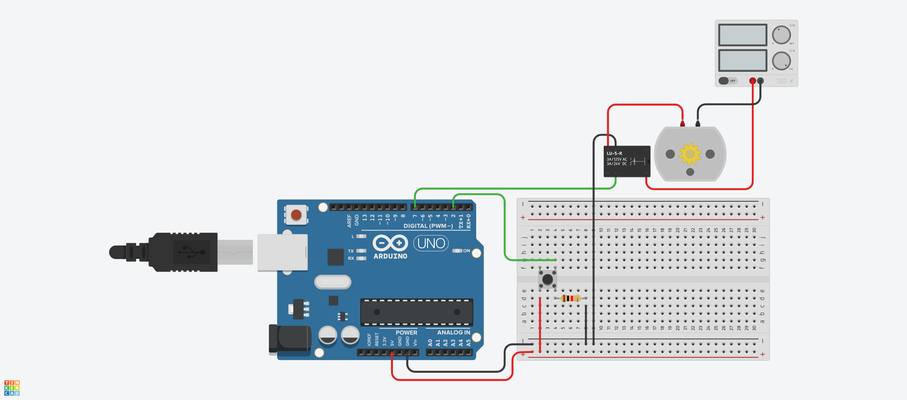

# DehumidifierPumpController
This is a little program written for an arduino to control a pump with a float switch.
Once the waterbucket is full and the float switch is triggered, the pump will be started for a defined amount of time.

Used components:
- 1x [Float Switch](https://s.click.aliexpress.com/e/_Ak53mK)
- 1x [Water Pump](https://www.aliexpress.com/item/32859594599.html?spm=a2g0s.9042311.0.0.27424c4dypXzoO)
- 1x [5V Relay](https://www.aliexpress.com/item/32358134833.html?spm=a2g0s.9042311.0.0.27424c4dyynnLY)
- 1x [Arduino Uno R3](https://www.aliexpress.com/item/32831857482.html?spm=a2g0o.productlist.0.0.19f16140AZZgOJ&aem_p4p_detail=202107131539031573662234321060028453385)
- 1x [12v Powersupply](https://s.click.aliexpress.com/e/_AWcEVU)
- 1x [Female DC Jack](https://www.aliexpress.com/item/32815757637.html?spm=a2g0s.9042311.0.0.27424c4dMtkAO7)
- 1x [Box (example)](https://s.click.aliexpress.com/e/_A2Mksa)
- 1x [12v to 5v for the Arduino](https://s.click.aliexpress.com/e/_AtmkyE)
- 1x [Outside connector to connect pump and float switch](https://s.click.aliexpress.com/e/_AVMj3k)
